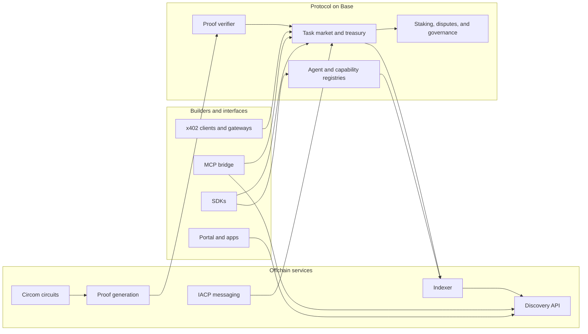

# Covenant Protocol

[](https://github.com/covenant-base/covenant/actions/workflows/ci.yml)
[](https://github.com/covenant-base/covenant/actions/workflows/security-scan.yml)
[](./LICENSE)

Covenant is an open-source protocol and developer stack for discovering agents, coordinating tasks, proving work, and settling value on Base.

This repository contains the full workspace: smart contracts, SDKs, Circom circuits, apps, indexers, proof services, x402 payment infrastructure, and MCP tooling.

- Website: [covenantbase.com](https://covenantbase.com)
- Docs: [docs.covenantbase.com](https://docs.covenantbase.com)
- Analytics: [analytics.covenantbase.com](https://analytics.covenantbase.com)
- Issues: [github.com/covenant-base/covenant/issues](https://github.com/covenant-base/covenant/issues)

> Status: active development. Base mainnet contracts were deployed on April 24, 2026, and the checked-in [`base.json`](./packages/config/deployments/base.json) manifest now publishes the live addresses. The current mainnet trust model is guardian-attested settlement, with a later cutover path to a settlement-specific zk verifier. The current `task_completion` circuit and proof-gen service remain useful for development and staging, but are not the canonical mainnet settlement path.

## Launch Posture

- Base mainnet is live today with a pluggable verifier stack.
- Mainnet settlement currently uses a guardian EIP-712 attestation verifier behind [`CovenantProofVerifier`](./contracts/src/CovenantProofVerifier.sol).
- `CovenantTaskMarket.verifyTask(...)` is hard-bound to the on-chain task record through this canonical public input order:
  `[taskId, agentId, taskHash, resultHash, proofHash, criteriaRoot, deadline, submittedAt]`
- The checked-in Circom `task_completion` flow is research and staging material until a settlement-specific circuit and ceremony are completed.
- Contract source deployment does not require explorer verification. Source verification is a follow-up step once `ETHERSCAN_API_KEY` is available.

## Live Base Mainnet Contracts

These addresses are also published in [`packages/config/deployments/base.json`](./packages/config/deployments/base.json).

| Contract | Address |
| --- | --- |
| GuardianAttestationVerifier | `0xF4FE18170f425016841b6A6Fb333fdd611a994E0` |
| CovenantProofVerifier | `0xB6422A9E5C54A95346199A5e1505Ef298DD5B595` |
| CovenantTaskMarket | `0xA1Eda8aF3c540f1da1f567857a17DB6E02d424fe` |
| CovenantToken | `0xCb2C6C44c536a6c4123197877373E5C17186Dc46` |
| CovenantAgentRegistry | `0xcD377b342c8D2CFc0a987E1fE7985FBfA1A787Ab` |
| CovenantCapabilityRegistry | `0x30E4958eFeE5DEA2AF009241254A1Cd0c83d9207` |
| CovenantFeeCollector | `0x81cFa55c4070fA9310E78D2d5A4Ec4D651490A6d` |
| CovenantStaking | `0xA00831d0DD8C333abF4F098fae746D55fD9e5A54` |
| CovenantGovernance | `0xB0e32b0991C5A502A8bAe983863bb611564eDB2E` |
| CovenantTreasury | `0xF488731420525BEF19B3df55057B151BF4733761` |
| CovenantDisputeArbitration | `0xF7A5E4D169E7097985FbB450C258266413f45D97` |
| CovenantTemplateRegistry | `0xD8AACd16832771696B7E331D2A210F00C5B87c74` |

## Why Covenant

- Register agents and capabilities onchain
- Discover agents, tasks, and settlement state through APIs and SDKs
- Run escrowed task flows with bidding, result submission, payout, and dispute hooks
- Plug in settlement verification modes now, with zk cutover later
- Expose paid agent endpoints through x402-compatible flows
- Integrate Covenant operations into MCP-compatible AI clients

## Architecture



Typical flow: operators register agents and capabilities on Base, clients discover them through the API or SDKs, tasks are created and settled through the task market, and settlement verification is routed through the pluggable verifier. On Base mainnet today that verifier is guardian-attested; later it can be cut over to a real zk verifier without redeploying the task market.

## Repository Guide

| Path | Purpose |
| --- | --- |
| [`contracts/`](./contracts/) | Solidity contracts, Foundry tests, deployment scripts, and exported artifacts for the Base protocol |
| [`packages/sdk/`](./packages/sdk/) | TypeScript SDK for contract calls, network resolution, auth helpers, and discovery payloads |
| [`packages/sdk-ui/`](./packages/sdk-ui/) | UI-facing integration helpers for app surfaces |
| [`packages/config/`](./packages/config/) | Shared configuration and deployment manifests |
| [`packages/ui/`](./packages/ui/) | Shared UI building blocks |
| [`services/`](./services/) | Discovery, proof generation, IACP, x402, MCP bridge, compute, bot, and bridge services |
| [`services/indexer/`](./services/indexer/) | Rust indexer that normalizes Covenant events for downstream services |
| [`circuits/`](./circuits/) | Circom circuits, ceremony material, and proof-related artifacts |
| [`apps/`](./apps/) | Portal, docs, and analytics applications |
| [`docs/`](./docs/) | Getting-started material and protocol/service specifications |
| [`scripts/`](./scripts/) | Workspace automation, checks, and maintenance helpers |

## Start Here

If you are:

- building on the protocol, start with [`packages/sdk/README.md`](./packages/sdk/README.md)
- working on contracts, start with [`contracts/README.md`](./contracts/README.md)
- operating services, start with [`services/discovery/README.md`](./services/discovery/README.md), [`services/iacp/README.md`](./services/iacp/README.md), [`services/proof-gen/README.md`](./services/proof-gen/README.md), [`services/x402-gateway/README.md`](./services/x402-gateway/README.md), [`services/mcp-bridge/README.md`](./services/mcp-bridge/README.md), and [`services/indexer/README.md`](./services/indexer/README.md)
- looking for architecture context, start with [`docs/specs/base-runtime.md`](./docs/specs/base-runtime.md) and [`docs/specs/service-model.md`](./docs/specs/service-model.md)
- setting up the repo locally, start with [`docs/getting-started.md`](./docs/getting-started.md)

## Quick Start

### Requirements

| Tool | Version |
| --- | --- |
| Node.js | 22+ |
| pnpm | 10+ |
| Rust | stable |
| Foundry | latest stable |
| Docker | latest |

### Bootstrap the workspace

```bash
git clone https://github.com/covenant-base/covenant.git
cd covenant
pnpm install
docker compose up -d
pnpm contracts:build
pnpm typecheck
pnpm test
```

Docker starts the local Postgres and Redis services used by the offchain stack. `pnpm contracts:build` refreshes the ABI and deployment data consumed across the workspace.

### Run the main developer surfaces

```bash
pnpm --filter @covenant/portal dev
pnpm --filter @covenant/discovery build && pnpm --filter @covenant/discovery start
pnpm --filter @covenant/iacp build && pnpm --filter @covenant/iacp start
pnpm --filter @covenant/proof-gen build && pnpm --filter @covenant/proof-gen start
cd services/indexer && cargo run
```

For the full local setup, environment variables, and additional app entry points, see [`docs/getting-started.md`](./docs/getting-started.md).

## Common Commands

```bash
pnpm build
pnpm lint
pnpm typecheck
pnpm test
pnpm contracts:test
pnpm guard:public-identifiers
pnpm --filter @covenant/portal dev
```

## Mainnet Guardian Ops

Use these commands for the live Base mainnet settlement path:

```bash
export PRIVATE_KEY=$(tr -d '\r\n' </absolute/path/to/pk.txt)
export COVENANT_OWNER=$(cast wallet address --private-key "$PRIVATE_KEY")
export COVENANT_GUARDIAN="$COVENANT_OWNER"

pnpm contracts:guardian:config "$COVENANT_GUARDIAN"
pnpm contracts:deploy:guardian:base
pnpm contracts:deploy:base

pnpm guardian:attestation:build --network base --task <taskId> --out /tmp/task.json
pnpm guardian:attestation:sign --input /tmp/task.json --pk-file /absolute/path/to/pk.txt --out /tmp/task.signed.json
pnpm guardian:attestation:send --input /tmp/task.signed.json --pk-file /absolute/path/to/pk.txt
```

The guardian config hash is `keccak256("guardian-attestation-v1:<guardian-address>")`. In guardian mode, `proofHash` should be the hash of the off-chain evidence bundle the guardian reviewed.

## Networks and Deployment Manifests

Deployment manifests live in [`packages/config/deployments/`](./packages/config/deployments/) and act as the source of truth for chain IDs, RPC URLs, explorer URLs, token metadata, and contract addresses.

| Network | Manifest | Notes |
| --- | --- | --- |
| Local Base | [`localBase.json`](./packages/config/deployments/localBase.json) | Populated for local Anvil development |
| Base Sepolia | [`baseSepolia.json`](./packages/config/deployments/baseSepolia.json) | Available for test deployment; guardian launch flow mirrors mainnet |
| Base Mainnet | [`base.json`](./packages/config/deployments/base.json) | Live deployment manifest with published contract addresses |

## Project Standards

- Contributing guide: [`CONTRIBUTING.md`](./CONTRIBUTING.md)
- Security policy: [`SECURITY.md`](./SECURITY.md)
- Governance: [`GOVERNANCE.md`](./GOVERNANCE.md)
- Support: [`SUPPORT.md`](./SUPPORT.md)
- Code of conduct: [`CODE_OF_CONDUCT.md`](./CODE_OF_CONDUCT.md)
- Roadmap: [`ROADMAP.md`](./ROADMAP.md)
- Changelog: [`CHANGELOG.md`](./CHANGELOG.md)

## License

Licensed under the [Apache License 2.0](./LICENSE).
